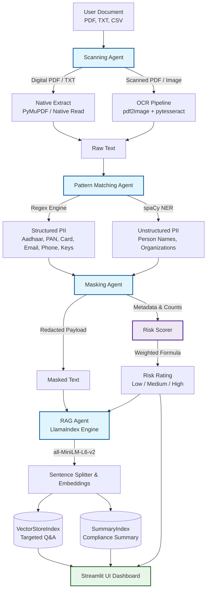

# 🛡️ MaskWise: Sensitive Data Detection & Compliance Assistant

[](https://www.python.org/)
[](https://maskwise.streamlit.app/)
[](https://opensource.org/licenses/MIT)

An enterprise-grade, privacy-first AI assistant that processes documents (PDF, TXT, CSV), detects and redacts sensitive/confidential information (PII/PHI) locally, classifies compliance risk, generates detailed audit summaries, and enables secure Q&A via Retrieval-Augmented Generation (RAG) without exposing raw sensitive data to external LLMs.

🔗 **Live Deployment:** [MaskWise Production Prototype](https://maskwise.streamlit.app/)

---

## 🏗️ Architecture Overview

MaskWise follows a deterministic-security, AI-assisted architecture where all extraction, pattern matching, and redaction occur locally before text is exposed to the LLM. 

### Processing Pipeline



### Module Breakdown
*   **Scanning Agent ([scanning_agent.py](file:///D:/Proteccio-Data/agents/scanning_agent.py)):** Determines document formats, page counts, and uses native extraction (PyMuPDF) with an automatic fallback to optical character recognition (OCR) via Tesseract for scanned/image-only PDFs.
*   **Pattern Matching Agent ([pattern_matching_agent.py](file:///D:/Proteccio-Data/agents/pattern_matching_agent.py)):** Employs a hybrid strategy combining highly optimized regular expressions for structured identifiers and NLP Named Entity Recognition (NER) for unstructured context.
*   **Masking Agent ([masking_agent.py](file:///D:/Proteccio-Data/agents/masking_agent.py)):** Performs deterministic local sanitization, replacing sensitive tokens with cryptographic placeholders (e.g., `[MASKED_AADHAAR_0]`) so raw values never traverse network boundaries.
*   **Risk Scorer ([risk_scorer.py](file:///D:/Proteccio-Data/risk_scorer.py)):** Runs a rule-based weighted assessment algorithm to label the document risk level (`Low`, `Medium`, or `High`), ensuring auditability.
*   **RAG Agent ([rag_agent.py](file:///D:/Proteccio-Data/agents/rag_agent.py)):** Leverages LlamaIndex to build in-memory vector and summary databases of the sanitized document text, providing conversational Q&A and safety summaries.

---

## 🧠 AI/ML Approach Used

MaskWise uses a hybrid AI/ML pattern optimized for high precision, data minimisation, and computational efficiency.

### 1. Hybrid Sensitive Entity Extraction
Instead of relying on heavy and potentially hallucination-prone LLMs for sensitive data detection, we combine two paradigms:
*   **Regular Expressions (Deterministic):** Handles structured patterns like Indian Aadhaar numbers, PAN cards, credit cards, emails, phone numbers, IFSC codes, API keys, and employee IDs.
*   **Named Entity Recognition (Probabilistic):** Employs a **spaCy** NLP model (`en_core_web_sm`) to catch unstructured sensitive variables (e.g., `PERSON` and `ORG` tags) that escape regular expressions.

### 2. Privacy-Guaranteed Retrieval-Augmented Generation (RAG)
To allow users to ask questions and generate summaries of confidential reports safely:
*   **Local Embedding Model:** Documents are chunked locally and embedded using `sentence-transformers/all-MiniLM-L6-v2` via HuggingFace.
*   **LlamaIndex Orchestration:** Two distinct indices are maintained:
    *   **VectorStoreIndex:** For semantic retrieval and answering specific questions.
    *   **SummaryIndex:** Uses tree-summarization to compile executive compliance summaries.
*   **Sanitized Context Window:** The context provided to the LLM (Gemini 2.5 Flash) contains *only* masked text. This prevents private raw data leaks to third-party endpoints.

### 3. Traceable Risk Classification
Rather than using a black-box machine learning classifier, we use a weighted rule-based model:
$$\text{Risk Score} = \sum (\text{Weight}_{\text{Category}} \times \text{Occurrences})$$

| PII Category | Severity Weight |
| :--- | :---: |
| Aadhaar, PAN, Credit Card | 10 |
| IFSC, API Key | 8 |
| Phone, Email | 3 |
| Employee ID | 2 |

*   **Low Risk:** Score < 5
*   **Medium Risk:** 5 $\le$ Score < 15
*   **High Risk:** Score $\ge$ 15

---

## ⚡ Setup Instructions

### Prerequisites
*   **Python:** Version 3.9, 3.10, or 3.11
*   **System Binaries (Required for OCR fallback):**
    *   **Tesseract OCR:** Required to scan image-based PDFs.
    *   **Poppler:** Required to convert PDF pages to images.

#### System Dependencies Installation
*   **macOS:**
    ```bash
    brew install tesseract poppler
    ```
*   **Ubuntu/Linux:**
    ```bash
    sudo apt-get update
    sudo apt-get install -y tesseract-ocr poppler-utils
    ```
*   **Windows:**
    1. Download and install Tesseract from [UB Mannheim](https://github.com/UB-Mannheim/tesseract/wiki). Add it to your System PATH variables.
    2. Download Poppler for Windows, extract it, and add the `bin/` directory to your System PATH.

---

### Local Installation

1.  **Clone the Repository:**
    ```bash
    git clone https://github.com/VinaySiddha/MaskWise.git
    cd MaskWise
    ```

2.  **Create and Activate Virtual Environment:**
    ```bash
    python -m venv venv
    
    # On Windows (CMD/PowerShell)
    .\venv\Scripts\activate
    
    # On macOS/Linux
    source venv/bin/activate
    ```

3.  **Install Python Packages:**
    ```bash
    pip install -r requirements.txt
    ```

4.  **Download spaCy Language Model:**
    ```bash
    python -m spacy download en_core_web_sm
    ```

5.  **Configure Environment Variables:**
    Create a `.env` file in the root directory (this is automatically ignored by Git):
    ```env
    GEMINI_API_KEY=your_google_gemini_api_key_here
    ```

6.  **Run the Streamlit Dashboard:**
    ```bash
    streamlit run app.py
    ```

---

## 🛡️ Challenges Faced & Solutions

*   **Computational Bottleneck in OCR:** 
    *   *Challenge:* Running OCR over large digital documents was slow and resource-heavy.
    *   *Solution:* We implemented a conditional extraction path. PyMuPDF attempts native text extraction first. OCR (using `pdf2image` and `pytesseract`) is triggered only as a fallback when pages yield minimal text characters.
*   **Maintaining Context in Masked Text:** 
    *   *Challenge:* Complete redaction can render document text incomprehensible, causing the RAG model to lose context and fail to answer user questions.
    *   *Solution:* Instead of replacing text with blank space or generic redactions, we use semantic masking tokens (e.g., `[MASKED_PERSON_1]`, `[MASKED_EMAIL_0]`). This preserves the grammatical structure and context for LlamaIndex query routing.
*   **PII False Positives in Regex:** 
    *   *Challenge:* Simple regex matches can catch non-sensitive strings (e.g., general 16-digit serial numbers matching Credit Cards, or random string codes matching PANs).
    *   *Solution:* Added strict lookahead and lookbehind rules, and structured regex patterns tailored specifically to format structures (e.g., Indian Aadhaar/PAN syntax).
*   **Session State Synchronization:** 
    *   *Challenge:* Keeping multi-agent outputs, document embeddings, and Q&A history synchronized without restarting Streamlit's runtime on state modifications.
    *   *Solution:* Implemented a structured session dictionary inside Streamlit's state cache to preserve extracted payloads and pre-indexed LlamaIndex query engines.

---

## 🚀 Future Improvements

- [ ] **Luhn Algorithm Verification:** Add validation checks on matches for credit card strings to eliminate false positives.
- [ ] **Microservices Decomposition:** Move agents (Scanning, Pattern Matching, Masking, RAG) to standalone containerized FastAPI services behind an API Gateway.
- [ ] **Fine-tuned BERT/RoBERTa NER:** Replace the default English spaCy model with a transformer model fine-tuned on corporate/Indian compliance documents to capture names/organizations with higher precision.
- [ ] **Role-Based Access Control (RBAC):** Add user authentication with views restricted by privilege level (e.g., administrators see raw data, analysts see masked data).
- [ ] **Additional Format Support:** Implement parsers for Microsoft Word (`.docx`), Excel sheets (`.xlsx`), and direct image files (`.jpg`/`.png`).
- [ ] **Audit Trail Logs:** Securely log audit logs tracking *who* scanned *what* files, which categories of PII were discovered, and the assigned risk labels.
